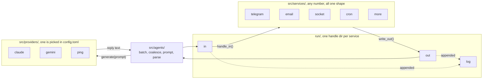

# microagent

An autonomous, always-on agent harness where **everything is a file(tm)**. Every channel the agent talks through (telegram, email, a TCP socket, cron) is just a directory of Unix IPC handles. Anything can write a line to a FIFO to send a message and the harness reads a FIFO to receive it. This is an experiment to try to get the most minimal extensible harness that is still featureful, and do so by hacking the features Unix provides.

```
$ cd .microagent                                                  # the home dir (all handles live in <home>/run/)
$ echo hi > run/agent/in                                          # wake the agent
$ echo '{"address":"123456789","body":"yo"}' > run/telegram/in    # send as the agent
$ echo 'in 300 water the plants' > run/cron/in                    # schedule a wake
$ tail -f run/telegram/log                                        # watch a channel
```

## The idea

The interface is the filesystem. A **service** (telegram, email, socket, cron, ...) owns exactly one directory of handles. `in` (FIFO it consumes), `out` (FIFO it emits on), `log` (append-only mirror of both). That directory is its entire contract, so a service could become a separate process, or a shell script, without the harness noticing. The harness itself owns `run/agent/` in the same shape: a line on `in` wakes the agent, `out` carries anything the agent addresses to `agent`, and `log` mirrors both.

Every service is the same two methods, and every provider is one. The harness reads each `out` and writes any `in`, and it never learns which service is which:



The LLM is strictly a text provider that takes input, does what it wishes, and responds with text. Tool calling and other behavior can be provided through an agent harness within the agents directory but the backbone of the harness is completely agnostic.

So the three pluggable pieces are small and independent:

| `src/` dir | You write | Wired by |
|---|---|---|
| `services/` | a class with `handle_in()` + something that calls `write_out()` | `[services.<name>]` in config.toml |
| `providers/` | `async def generate(prompt) -> str` | `provider = "<name>"` in config.toml |
| `agents/` | the loop policy itself | `main.py` |

Each plugin is one file; the loader finds the Service or Provider subclass it defines (set `Plugin = ClassName` only if a module holds more than one). Read `src/services/socket.py` for the shortest complete example, and `src/lib/handle.py` for the FIFO mechanics.

## Why FIFOs

A FIFO is slower than a socket, and it carries less structure than a protocol like MCP. So why do I do this to myself? The trade is worth it for two reasons.

1. You can drive the **whole** system from a shell. Writing to a channel is as easy as `echo >`. Watching a channel's output is `tail -f`. There is no broker to start and no client to build. This flexibility makes it a breeze to make a new plugin or test the system through its interfaces.

2. You can also **look** at a file. When something goes wrong, read the `log` for that channel. You see what the harness saw, in order, with nothing to decode first.

## Run a microagent

The following primarily is a setup for a claude code provider but is essentially the same for any pluggable llm provider

### Configure

`.microagent/config.toml` decides which agent, which provider, and which services you want:

```toml
timezone = "America/New_York"  # clock for logs, cron dailies, and the agent

[agents.primary]
provider = "claude"          # "claude" | "gemini" | "ping" or any agent you add

[services.socket]
enabled = true
port = 8765

[services.telegram]
enabled = true
allowed_chat_ids = [123456789]

[services.web_chat]
enabled = true               # the dashboard's chat pane rides on this channel

[dashboard]
enabled = true
port = 8767
```

See `src/defaults/config.default.toml` for the annotated version with every option.

`.microagent/soul.md` is the agent's personality.

`.env` holds secrets only: `CLAUDE_CODE_OAUTH_TOKEN`, `GEMINI_API_KEY`, `TELEGRAM_BOT_TOKEN`, `EMAIL_PASSWORD`, `DASHBOARD_TOKEN`.

Set `provider = "ping"` for a no-LLM test (it answers `pong` to everything). 

### Run it locally

Everything mutable lives in one home dir `.microagent/` in the repo by default (override with `MICROAGENT_HOME`). It's created and seeded on first boot.

`config.toml`, `soul.md`, and `.env` are configurable and should be set up before you run. `.env` may sit at the repo root or inside the home. The home copy wins if both exist.

```fish
pip install -r requirements.txt
echo 'CLAUDE_CODE_OAUTH_TOKEN=...' > .env   # or skip, and use provider = "ping"
python3 src/main.py
```

The process exits on purpose when you hit restart/update in the dashboard, so for an always-on run wrap it in a loop (Docker's `restart: unless-stopped` does this for you):

```fish
while python3 src/main.py; sleep 1; end          # fish
while python3 src/main.py; do sleep 1; done      # bash/zsh
```

### Run it in Docker 

```fish
docker compose run --rm -it microagent claude setup-token   # get an OAuth token
# put it in .env as CLAUDE_CODE_OAUTH_TOKEN=...
docker compose up -d --build
```

`run/` is a tmpfs inside the container, so the handle tree is reached from there rather than from the host: `docker exec microagent sh -c 'echo hi > /microagent/.microagent/run/agent/in'`. On a Linux host you can drop the `tmpfs:` line from `docker-compose.yml` to get host-visible FIFOs; on macOS you can't, because FIFOs don't work over the bind mount at all.

The dashboard listens on port 8767 (on every interface by default; set `host = "127.0.0.1"` to keep it machine-local). It is a viewer over the handle tree plus a chat pane, and it can also act: restart, update to origin/main, and rotate .env keys.

## Project retroactive

The hard part was really making the base classes for the pluggable features. Extensibility is the point of the project, so a fat base class defeats the one feature it exists to give you. A developer who has to study `base_service.py` before writing a plugin won't write one.

Most of the work was removal. The risk is a base class with several verbs that overlap, where the names don't tell you which one to use. `Service` now has one method you write, `handle_in()`, and one you call, `write_out()`. `Provider` has one method, `generate(prompt) -> str`. Everything else has a default.

## Limitations

- A FIFO exchange is slower and uses more context than a structured transport like MCP.
- The handle tree applies to only one host. Separate agents run in separate places with no problem, but they do not share a tree.
- Docker adds its own limits to what the agent can reach.
- The Claude OAuth token is the roughest part of setup.
